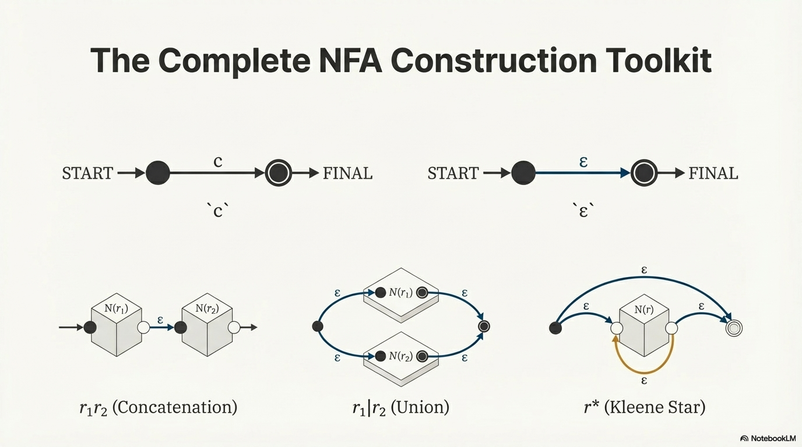

## 词法分析：Token 切分
在前一节中，我们知道词法分析是编译器前端的第一步，它的主要任务是将源代码的字符串切分为一个个标记（token）。

例如，在我们的 while + DB 语言中，就有下面的几类 token：
- 运算符
- 赋值符号
- 间隔符（各种括号、分号）
- 自然数
- 变量名
- 保留字
- 内置函数名

根据不同标记承担的语法功能是否相同，可以将标记分为若干类。事实上，在上述列举的标记除了所
有自然数分为一类，所有变量名分为一类之外，其他每个标记应当单独分为一类。下面是标记分类在 C 语言中的定义（`lang.h`）。
```c
// 标记分类在 C 语言中的定义 (见于 lang.h)
enum token_class {
    // 运算符 (Operators)
    TOK_OR = 1, TOK_AND, TOK_NOT,
    TOK_LT, TOK_LE, TOK_GT, TOK_GE, TOK_EQ, TOK_NE,
    TOK_PLUS, TOK_MINUS, TOK_MUL, TOK_DIV, TOK_MOD,

    // 赋值符号 (Assignment Symbol)
    TOK_ASGNOP,

    // 间隔符号 (Delimiters/Separators)
    TOK_LEFT_BRACE,   // {
    TOK_RIGHT_BRACE,  // }
    TOK_LEFT_PAREN,   // (
    TOK_RIGHT_PAREN,  // )
    TOK_SEMICOL,      // ;

    // 自然数与变量名 (Literals and Identifiers)
    TOK_NAT,          // 自然数
    TOK_IDENT,        // 变量名

    // 保留字 (Reserved Words)
    TOK_VAR, TOK_IF, TOK_THEN, TOK_ELSE, TOK_WHILE, TOK_DO,

    // 内置函数名 (Built-in Functions)
    TOK_MALLOC,
    TOK_RI, // read_int
    TOK_RC, // read_char
    TOK_WI, // write_int
    TOK_WC  // write_char
};

// 标记携带的额外数值信息定义
union token_value {
    unsigned int n;  // 当标记属于 TOK_NAT 时，存储无符号整数值
    char * i;        // 当标记属于 TOK_IDENT 时，存储标识符字符串地址
    void * none;     // 其他情况下不存储额外信息
};
```

**说明：**
- **`TOK_NAT`** 和 **`TOK_IDENT`** 是两类特殊的标记，除了标记类别外，还需要在 `union token_value` 中存储具体的属性值。
- 在词法分析工具 **Flex** 的配置中，标识符的规则不需要显式排除保留字，只需将**保留字的匹配规则放置在标识符规则之前**即可。

可以看到，在上面的代码中，我们主要定义了两个类别：
- `token_class`：这个 token 属于哪一类？它是一个抽象的类别，而不是一个具体的值。
- `token_value`：这个 token 有什么值？它是词法单元的具体内容，提供了该单元在源代码中的原始信息。

用 `token_class` 和 `token_value` 就可以完全确定一个 token 的信息。

> [!NOTE]
> **Token Class** 和 **Token Value** 的关系可以类比为**一个对象的类型和它的具体内容**。
> - 编译器在**语法分析**时，主要依赖 **Token Class** 来判断语法是否正确。例如，语法规则要求在赋值操作符后面必须是一个表达式，那么语法分析器会检查后面跟着的 Token 类别是否正确。
> - 编译器在**语义分析**和**代码生成**时，主要依赖 **Token Value** 来进行具体操作。例如，它需要知道变量的名字是 `"x"` 而不是 `"y"`，或者数字的值是 `1` 而不是 `2`，才能正确地生成代码。


## 正则表达式 Regualr Expression
正则表达式（**Regular Expression**），通常简称为 **RegEx** 或 **RegExp**，是一种用来**描述符合特定句法规则的字符串集合**的工具，可以理解为，正则表达式是一种字符串集合的简写方法。


正则表达式本身的语法结构定义如下：

$$
r :: = c  \mid \epsilon \mid r|r \mid rr \mid r*
$$

上面这五类，都是正则表达式的合法结构，它们各自的含义是：
- 单个字符（$c$）
- 空字符串（$\epsilon$）
- 两个字符串的并集（$r|r$），表示两个字符串中，至少出现一个即可。
- 两个字符串的连接（$rr$）
- 重复出现一类字符串 0 次、1 次或多次（$r*$）

优先级：
- $* > 连接 > |$


一些正则表达式的常见简写：
- **字符的集合（Character Sets）：** 使用方括号表示一组字符中的任意一个。例如，`[a-cA-C]` 表示 `a|b|c|A|B|C`。
- **可选的字符串（Optional）：** 使用 `?` 表示一个结构可以出现 0 次或 1 次。`r?` 等价于 `r|ϵ`（其中 $ϵ$ 表示空串）。例如，`a?b` 可以匹配 `b` 或 `ab`。
- **重复至少一次（At least once）：** 使用 `+` 表示一个结构重复出现 1 次或多次。例如，`a+` 表达的字符串集合包括 `a`, `aa`, `aaa` 等。
- **字面字符串（Literal Strings）：** 使用双引号直接表示字符串本身。例如，`"abc"` 表达的字符串就是 `abc`。
- **自然数常量：** 简写为 `"0"|[1-9][0-9]*`，表示以非 0 数字开头的一串数字或者数字 0。
- **标识符（Identifiers）：** 常用的简写为 `[_a-zA-Z][_a-zA-Z0-9]*`。这表示第一个字符必须是字母或下划线，后续可以包含字母、下划线与数字。

## 有限状态自动机 Finite State Automaton
### FSA 定义
有限状态自动机包含：
- 一个状态集合（图中的节点）与一组状态转移规则（图中的有向边）。
- 每一条边（状态转移规则）上有一个符号集合
	- 表示输入该集合中的符号，可以经过该有向边，从一个状态转移到下一个状态。
- 状态集中有一个起始状态（大圈，用 INIT 表示）和一个或多个终止状态（用一个双圈表示）。

Gemini 给出的 FSA 的组成：
- **有限个状态集合（States）**：这是机器可能处于的所有状态。例如，你可以有“起始状态”、“处理数字状态”、“处理变量名状态”等。
- **一个起始状态（Start State）**：机器开始工作时的初始状态。
- **一个或多个接受状态（Accept States / Final States）**：如果机器在处理完整个输入字符串后，最终停留在其中一个接受状态，那么这个字符串就是被接受（匹配）的。
- **一个转移函数（Transition Function）**：这个函数定义了机器从一个状态**转移**到另一个状态的规则。这个规则由**当前状态**和**输入字符**共同决定。

可以看到，FSA 就是表示状态转移的有向图，没什么复杂的地方。

FSA 分为两种：DFA 和 NFA
- **确定性有穷自动机（DFA）**：
	- 每一条状态转移规则上的符号都是 ASCII 码字符
	- 每个状态和每个输入字符都只有一个确定的转移路径。
- **非确定性有穷自动机（NFA）**：
	- 每一条状态转移规则上的符号要么是 ASCII 字符，要么是 $\epsilon$
	- 可以有多个转移路径。
	- 在某些状态上不需要输入就可以转移，及通过 $\epsilon$ 转移规则时，不消耗字符串中的字符。

简单来说，NFA 中存在“空转移”的有向边，且转移路径不唯一；而 DFA 则不接受“空转移”，必须消耗一个字符，并且要求转移路径唯一。

是否具有确定性，是 NFA 和 DFA 的核心区别。

## 利用 FSA 判断字符串能否被正则表达式接受（重点）
> [!NOTE] 自动机接受字符串的判定条件
> 一个自动机能接受一个字符串，当且仅当存在一种状态转移的方法，可以从自动机的起始状态出发，依次经过这个字符串的所有字符，并最终停在终止状态。

不难发现：
- 判断字符串能否被 DFA 接受，很容易，因为每一步能不能走、走到哪去，都是确定的。
- 但是，判断能否被 NFA 接受，就不太容易，因为每一步可能存在多种走法，需要判别的情况较多。

因此，我们最终希望得到一个 DFA，但是直接得到 DFA 并不容易，所以我们通过 NFA 过渡一下。

利用 FSA 判断一个字符串是否落在一个正则表达式限定的字符串集合中。通常有下面两个步骤：
- 由正则表达式生成 NFA
- 由 NFA 生成 DFA

### 将正则表达式转化为 NFA
这种方法叫做“汤普森构造法”，详见：[汤普森构造法 - 维基百科，自由的百科全书](https://zh.wikipedia.org/wiki/%E6%B1%A4%E6%99%AE%E6%A3%AE%E6%9E%84%E9%80%A0%E6%B3%95)

目标：每个正则表达式构造一个 NFA，使得一个字符串能被这个 NFA 接受，当且仅当这个字符串是正则表达式表示的字符串集合的元素。（具体构造见老师的 pdf 讲义）
- 原子 $c$：从起始状态到下一个状态，直接连一条标记 $c$ 的边即可。
- 空串 $\epsilon$：同上，直接连一条标记 $\epsilon$ 的边即可。
- 连接 $r_{1}r_{2}$：构造两个 NFA 串联即可，即在两者各自的 NFA 之间连一条 $\epsilon$ 的边。
- 选择 $r_{1} | r_{2}$：构造两个 NFA 并联即可，即从 INIT 到两者的 NFA 起点各连一条 $\epsilon$ 的边，以及从两者 NFA 的结束到整个结束各自一条 $\epsilon$ 的边。
- 重复 $r*$：构造一个带回路的 NFA。



### 将 NFA 转化为 DFA
这种方法叫做“子集构造法”，详见：[wiki/docs/编译原理/子集构造法.md at main · JuniMay/wiki · GitHub](https://github.com/JuniMay/wiki/blob/main/docs/%E7%BC%96%E8%AF%91%E5%8E%9F%E7%90%86/%E5%AD%90%E9%9B%86%E6%9E%84%E9%80%A0%E6%B3%95.md)

目标：将 NFA 转为 DFA，使得该 DFA 对应的正则表达式和转化前的 NFA 相同：
- 先在 NFA 中确定初始状态：
	- INIT 节点，以及和 INIT 节点通过 $\epsilon$ 边可以走到的节点的集合。
- 然后，从初始状态开始，每次选定一个状态，并选定一类字符串消耗，看看至多能走多少个点（包含后续通过 $\epsilon$ 边可以走到的点），把这些节点状态集合，作为 DFA 中的一个新的节点。
- 遍历完所有状态，得到所有的集合，根据它们之前的转换关系构造 DFA。
- **接受状态如何判定**？只要 DFA 中的节点表示的集合中，包含至少一个原本 NFA 中的接受状态，那么该节点在 DFA 中就是接受状态了。

更专业的描述：
1. **初始：** 计算 NFA 初始状态的 $\epsilon$ -闭包，作为 DFA 的起始节点。
2. **迭代：** 对于当前的每个 DFA 节点，针对字母表中的每个字符 $c$，计算该集合内所有成员通过 $c$ 转移并经过 $\epsilon$ 边后能到达的所有 NFA 状态，形成新节点。
3. **判定：** 凡是包含原 NFA **终止状态节点**的 DFA 节点，均标记为 **接受节点（Accepting State）**。

